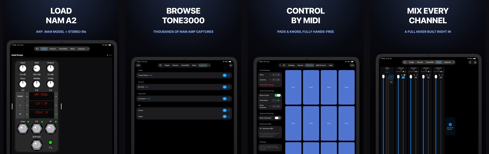
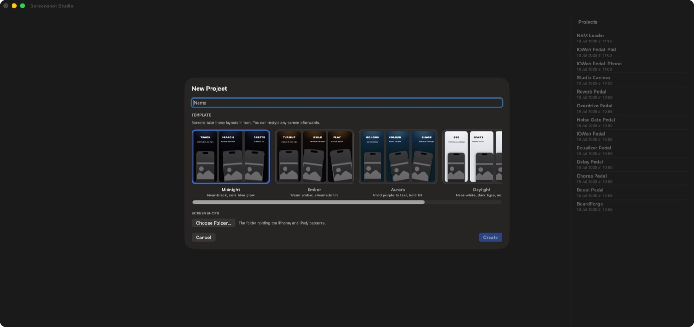
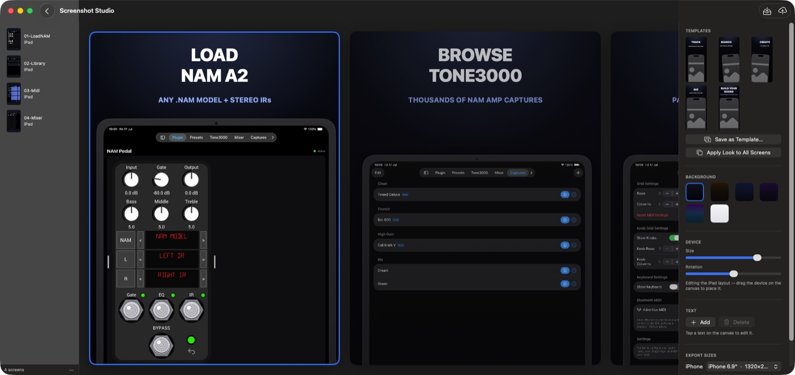
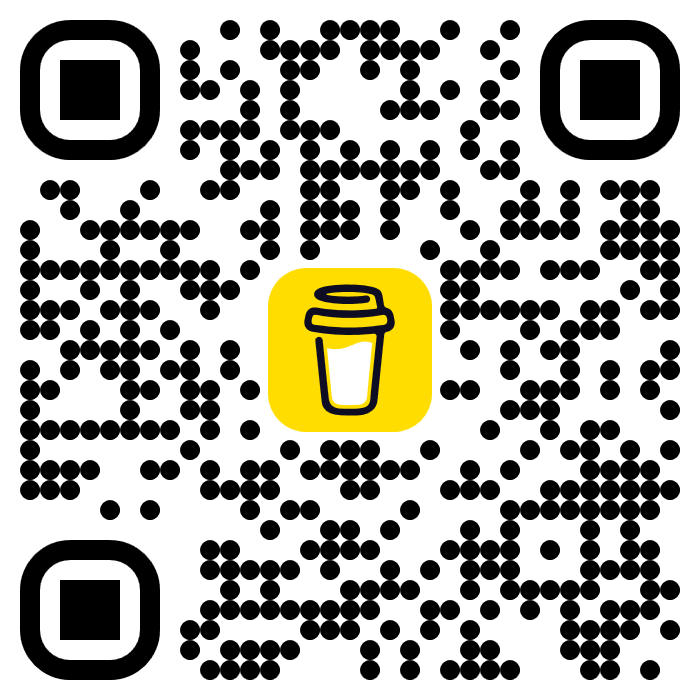

# Screenshot Studio

A macOS app that turns raw iOS simulator captures into a finished App Store
gallery — each screen framed in a device mockup, captioned, laid out on a styled
background, and rendered at Apple's exact pixel sizes, ready to upload to App
Store Connect.



> Above: four screens of the **NAM Loader** app, imported as raw simulator
> captures and framed, captioned, and laid out in Screenshot Studio.

The workflow is two steps:

1. **Generate the raw screenshots** with a UITest run on a simulator.
2. **Open them in Screenshot Studio** to frame, caption, arrange, export, and
   upload the gallery.

## Use it with a coding agent

Install the agent skill into your app's repo and let Claude Code (or any
skill-aware agent) drive the whole flow — capture with a UITest, then frame and
upload. Then just ask: *"make App Store screenshots for this app."*

**Option A — [skills.sh](https://skills.sh):**

```bash
npx skills add https://github.com/rafabertholdo/screenshot-studio --skill screenshot-studio
```

**Option B — Claude Code plugin:**

```
/plugin marketplace add rafabertholdo/screenshot-studio
/plugin install screenshot-studio
```

Either way the agent gets [`screenshot-studio/SKILL.md`](screenshot-studio/SKILL.md),
which teaches it to write/run the capture UITest, extract the PNGs, and operate
Screenshot Studio.

---

## Step 1 — Generate the raw screenshots (UITest)

Screenshot Studio doesn't drive the simulator itself — it takes the raw captures
your app's **UITest** produces. A UITest walks the app through each screen you
want to sell and saves a PNG per screen on an iPhone and an iPad simulator.

What a good capture run gives you:

- One PNG per screen, for **both** an iPhone and an iPad simulator (the App Store
  needs a gallery for each size).
- A **folder per device** — `iPhone/` and `iPad/` — side by side:

  ```
  screenshots/
    MyApp/
      iPhone/
        iPhone 16e-01-Launch.png
        iPhone 16e-02-Editor.png
        …
      iPad/
        iPad Pro 13-inch (M5)-01-Launch.png
        iPad Pro 13-inch (M5)-02-Editor.png
        …
  ```

- **Numbered, matching filenames.** The `NN-` prefix (`01-`, `02-`, …) sets the
  gallery order, and the shared name after it (`-Editor`) is how Screenshot Studio
  pairs the iPhone and iPad shot of the same screen into one captioned slide.
- **A consistent appearance.** Pick light or dark and stick to it across every
  screen — a mixed gallery reads as broken in the store. Lock it in the app (e.g.
  `.preferredColorScheme(.dark)`) or force the simulator before the run
  (`xcrun simctl ui <device> appearance dark`).

Tips for the UITest itself:

- Drive to each screen and call `XCUIScreen.main.screenshot()`, saving with a
  zero-padded `NN-Name` so the order and pairing are unambiguous.
- Run it once on an iPhone destination and once on an iPad destination.
- **Don't edit the raw PNGs** — Screenshot Studio reads them as the source of
  truth and re-reads the folder every time it opens the project.

Once `iPhone/` and `iPad/` are full of numbered PNGs, you're ready for the app.

## Step 2 — Operate the app

### Create a project

Launch **Screenshot Studio** and choose **New Project**. Pick a **template** —
this is the background/style collection (gradients, mockup look) new screens start
from. Screens cycle through the template's looks so the gallery alternates layouts
instead of repeating one. You can change any screen's look afterward.



Then **import** the folder that holds your `iPhone/` and `iPad/` subfolders.
Screenshot Studio pairs the shots by their numbered name and builds one **slide**
per screen, ordered by the `NN-` prefix.

### Frame, caption, and arrange each slide



Select a slide in the sidebar and work on the canvas:

- **Caption** — add a headline and a subtitle. Drag them anywhere; snap guides
  help you line them up across slides. Keep headlines short — they don't wrap.
- **Device mockup** — the screenshot sits inside a device frame. Choose the
  mockup style (notch / Dynamic Island) to match the size you're targeting.
- **Placement** — move and scale the device on the canvas. If a screen's UI stops
  partway down, push the device lower so the empty space runs off the bottom edge.
- **Background** — switch the template/gradient behind the device per slide.
- **Preview both sizes** — toggle between the iPhone and iPad rendering. A screen
  captured for only one size falls back gracefully.

Projects are saved automatically as small JSON files in
`~/Documents/Screenshot Studio/` — just the folder path and the look of each
screen, never the screenshots themselves. Re-opening a project re-reads the
source folder, so adding a new capture there and reopening picks it up.

### Export

**Export** writes finished PNGs into `iPhone/` and `iPad/` subfolders of an
output directory, at the exact pixel size the App Store expects for each size.
Don't resize or post-process the output — App Store Connect validates the exact
dimensions.

> A **landscape** screen is rendered as two portrait panels side by side, so it
> reads as one wide shot in the gallery. It uses **2** of the App Store's 10
> screenshots-per-size slots.

### Upload to App Store Connect

Screenshot Studio can publish straight to a version, no external tools:

1. Open **Settings** and add your **App Store Connect API key** (`.p8`). It's
   stored once in your **login keychain** — never copied into preferences or
   written next to a project.
2. Use the **Upload** sheet: pick the app, the version, and the locale, then
   upload. Screenshot Studio renders the set, checks every size against the
   10-per-size limit **before** touching your account (so an oversized set fails
   cleanly instead of wiping your listing), and publishes.
3. Review the version in App Store Connect before submitting.

That's the whole loop: **capture → import → style → export/upload.** To refresh
screenshots for a new app release, re-run the UITest and reopen the project — the
styling you already did is reapplied to the fresh captures.

---

## Requirements

- macOS 14+


## Buy Me a Coffee ☕

This app is completely free — no paywalls, no subscriptions. If they saved
you time, a coffee helps me keep pushing updates and new features. Thank you!

[**Buy Me a Coffee ☕**](https://www.buymeacoffee.com/rafabertholdo)

<a href="https://www.buymeacoffee.com/rafabertholdo"></a>

## Release notes

### v1.1 — current

- **Direct App Store Connect upload** from the app: add your `.p8` key once (kept
  in the login keychain), then publish a whole gallery to a version and locale.
- **Pre-flight validation** — every size is checked against the 10-per-size limit
  before your listing is touched, so a bad set never leaves it half-updated.
- **Landscape screens** render as two side-by-side portrait panels.
- Templates cycle across imported screens for a varied, consistent gallery.

### v1.0

- Initial editor: import a folder of simulator captures, caption them, frame them
  in device mockups, and export PNGs at exact App Store sizes.
